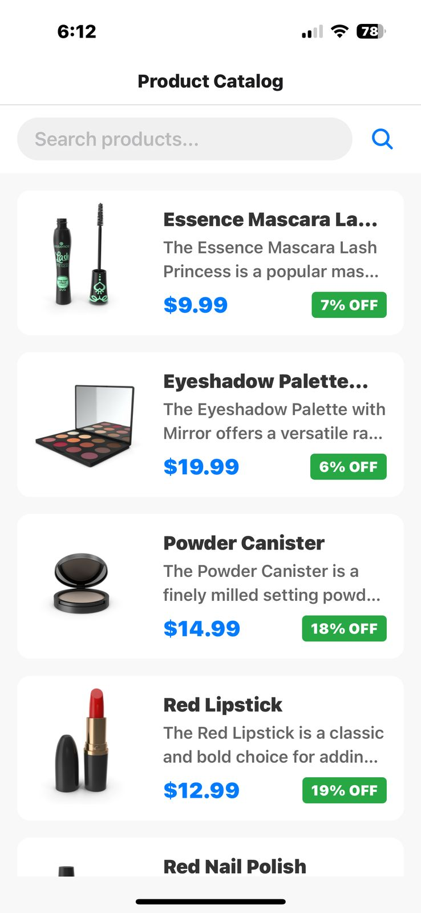
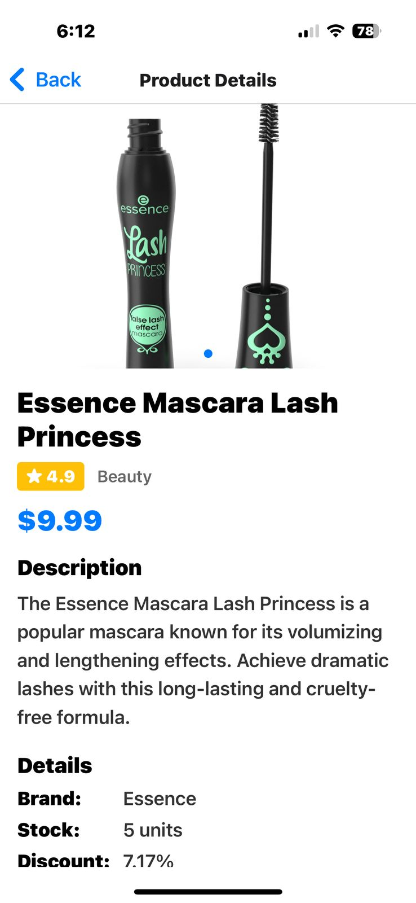
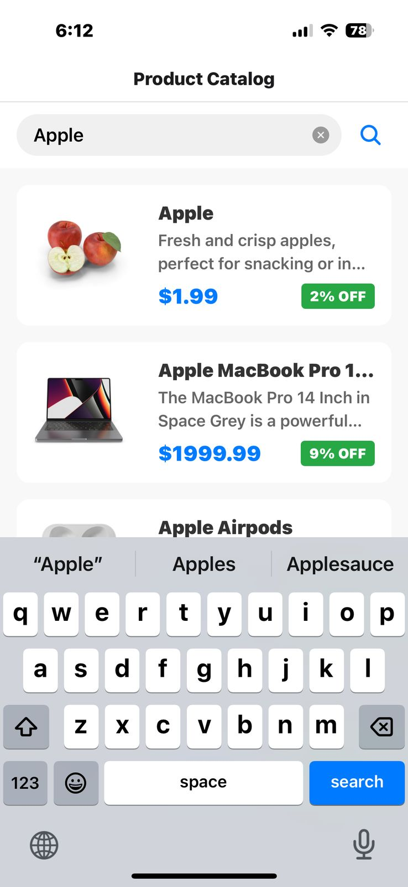

# 🛍️ Product Catalog App - Zynetic

A mobile-first product catalog app built using **React Native** and **Expo**, designed to help users view and manage product listings with a clean, vibrant UI.

---

# 🛍️ Folder Structure

ProductCatalogApp/
|
├── assets/
|   └── screenshots/
|       ├── home.jpg  
|       ├── product_detail.jpg  
|       └── search_product.jpg  
|
├── src/
|   ├── api/
|   |   └── productApi.js  
|   |
|   ├── components/
|   |   ├── ErrorView.js  
|   |   ├── ImageCarousel.js  
|   |   ├── LoadingIndicator.js  
|   |   └── ProductCard.js  
|   |
|   ├── navigation/
|   |   └── AppNavigator.js  
|   |
|   └── screens/
|       ├── ProductDetailsScreen.js  
|       └── ProductListScreen.js  
|
├── App.js  
├── app.json  
├── index.js  
├── package.json  
├── package-lock.json  
└── README.md


---

## 🚀 Setup Instructions

1. **Clone the repository and navigate to the project directory**
   ```bash
   git clone https://github.com/Shubham-mohapatra/productCatalog_Zynetic.git
   cd ProductCatalogApp
   
2. Install dependencies
   ```bash
     npm install

3. Start the Expo development server
    ```bash
      npx expo start

5. Run the app
Scan the QR code in the terminal using the Expo Go app on your Android/iOS device
Or press a to launch the Android emulator, i for iOS simulator (if configured)


## 📸 Screenshots

### 🏠 Home Screen



### 📦 Product Detail Screen



### Search Products


